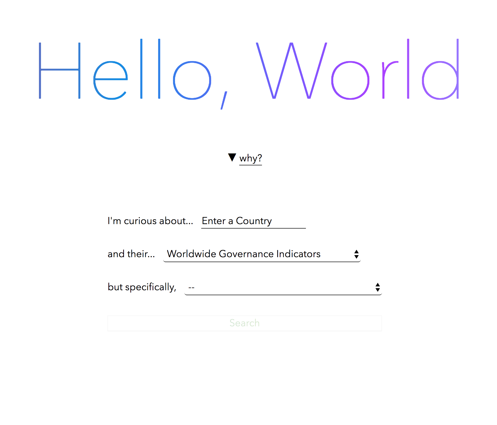
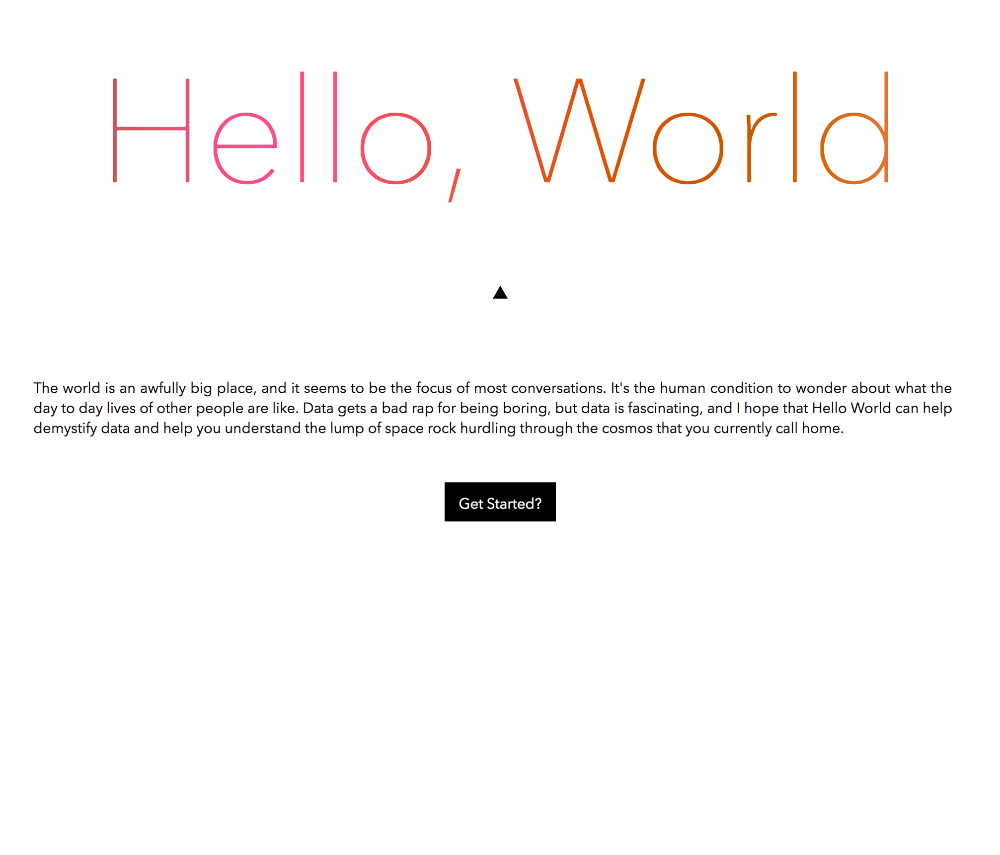
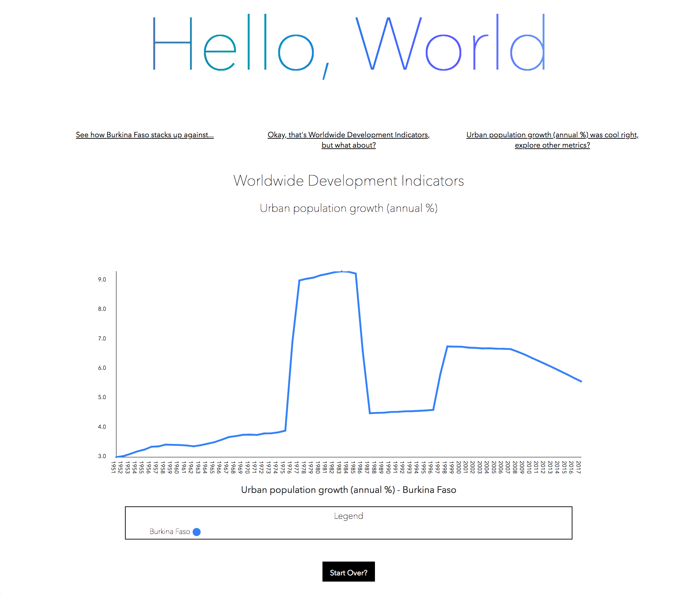

# Hello World
## Overview

The world is an awfully big place, and it seems to be 
the focus of most conversations. It's the human condition 
to wonder about what the day to day lives of other people 
are like. Data gets a bad rap for being boring, but data 
is fascinating, and I hope that Hello World can help 
demystify data and help you understand the lump of 
space rock hurdling through the cosmos that you 
currently call home.This project was made possible by public
data from the World Bank

This project was created with `create react app`

Set Up Instructions 
```
npm install --save-dev
npm start
```

## Collaborators
A Turing- Module 3 project:
[Jeremiah Stanley](https://github.com/jeremiahjstanley), 


## Screenshots
Home Page


Explanation Page


Graph Data

